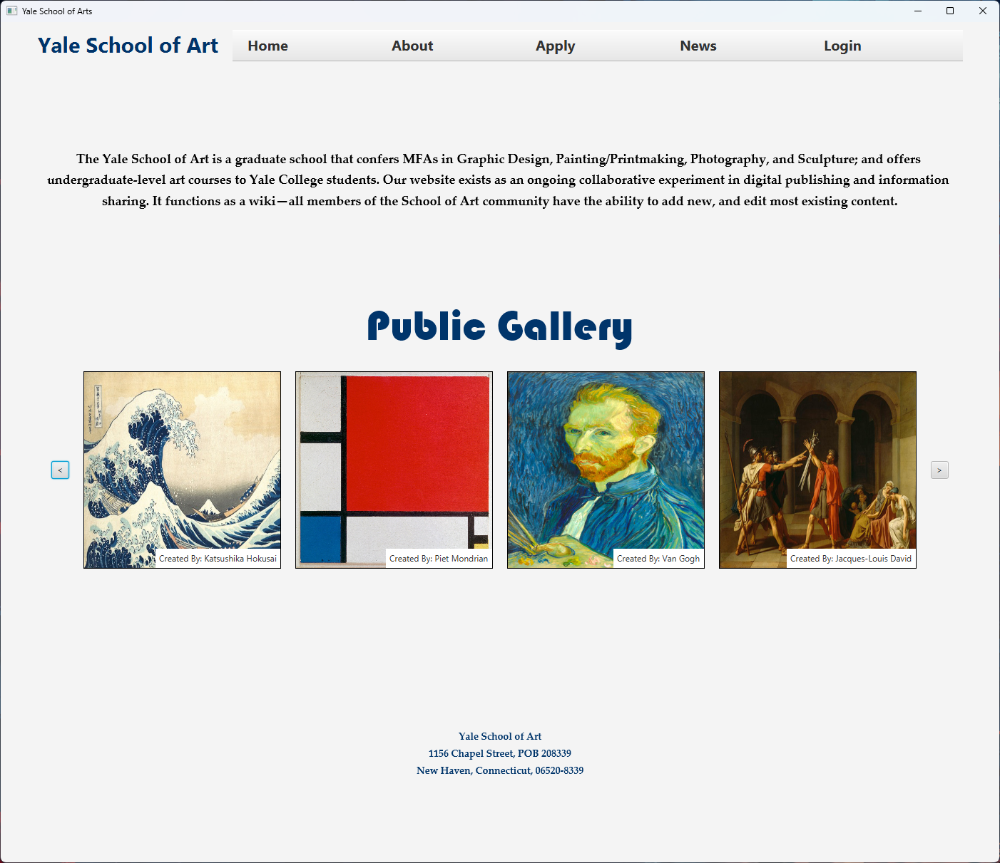
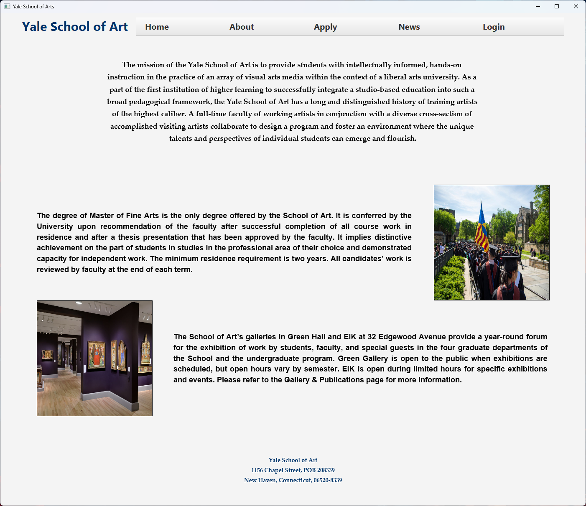
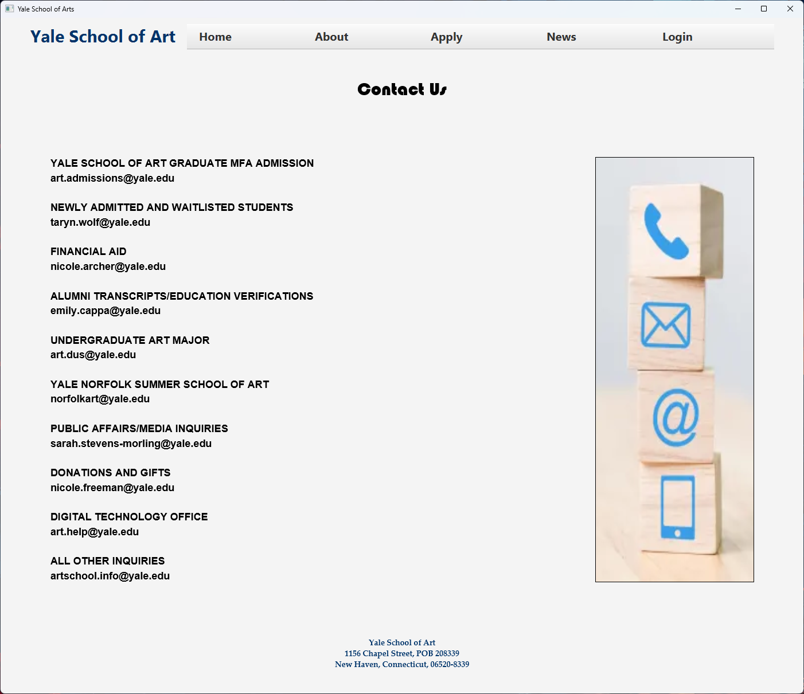
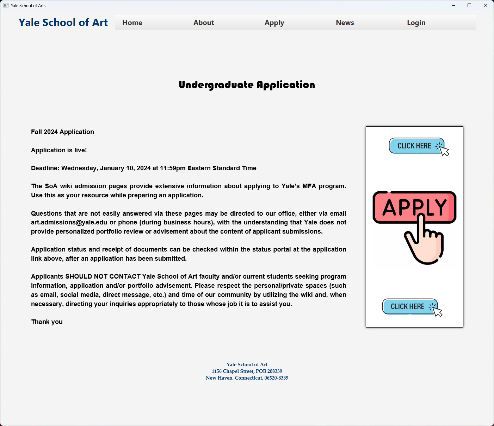
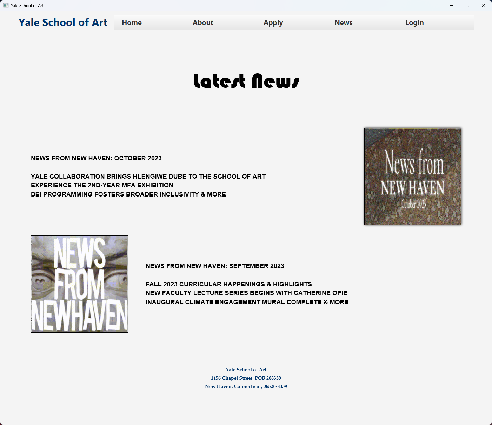
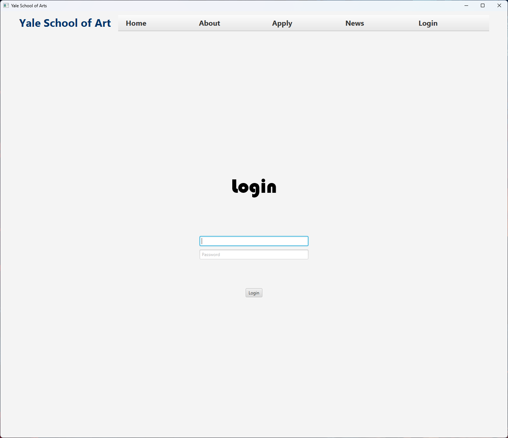
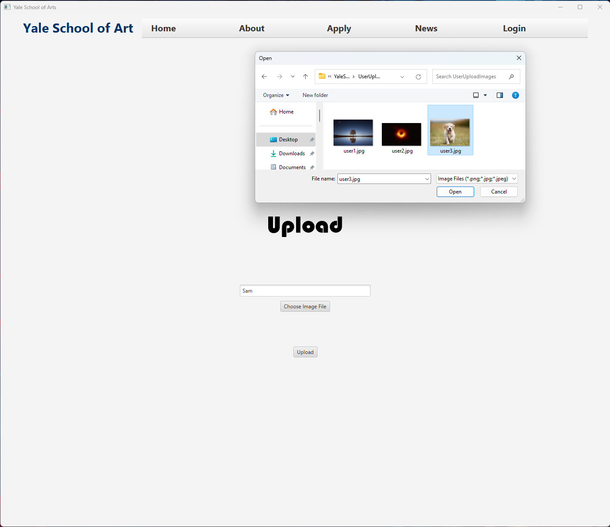
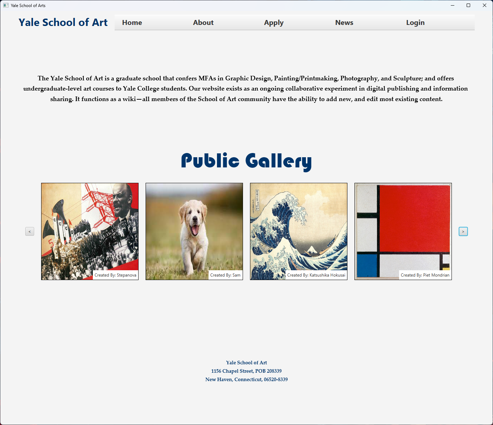

# YaleSchoolOfArt Project

## Project Members
- Michael Terrazas
- Brendan Martin
- Samin Hossain

## Project Goal
The primary objective of this project is to enhance the design of [Art at Yale](https://www.art.yale.edu/) by creating a user interface (UI) prototype.

## Our Redesign
### Home Page

### About Us Page

### Contact Page

### Undergraduate Application Page

### News Page

### Publications Page

### Login Page

### Upload Page

### Updated ome Page With User Upload
